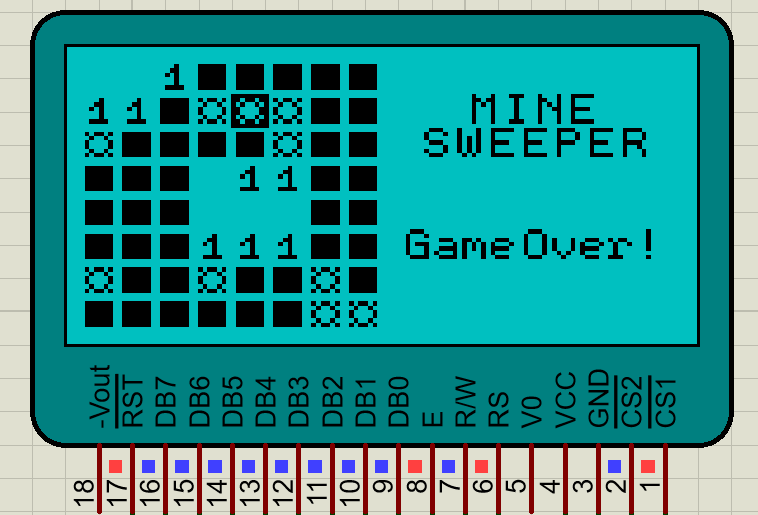
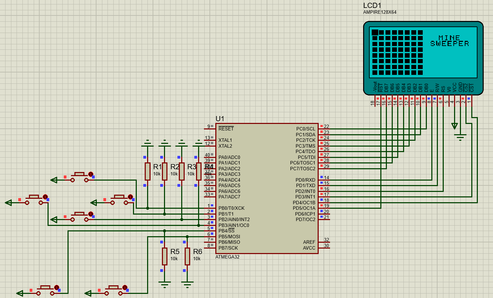

# Minesweeper-in-AVR
Final project of microcontroller course of IUT

## Equipments
    ATmega32
    K0108 GLCD
    Push button x6

or
## Simulator
Circut is simulated using Proteus (in "Simulation" directory).

left top four push buttons are arrow keys (top - right - down - left clockwise). and bottom left is select key and bottom right is flag key.

## Code
Code is written in C with Atmel studio (in "Code - Atmel" directory)

## Contributor
[Sana Mehrab Beigi](https://github.com/sanamehrabbeigi)

